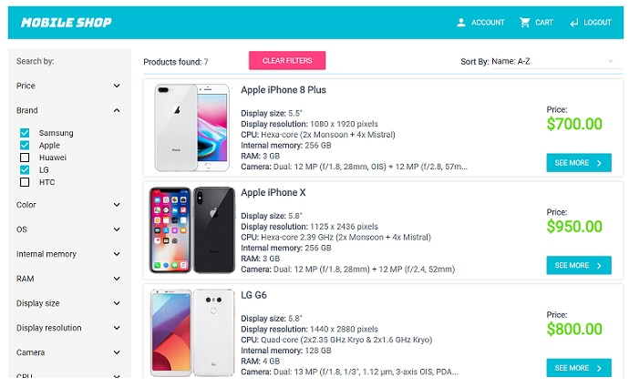

# MERN stack shopping cart

## Description

Shopping cart app build with MERN stack and using RESTful API design. Responsive front-end design done with Material-UI, Passport used for authentication, database hosted on mLab. Deployed on Heroku.

You can get and view the list of all products from the API, register, add products to cart, remove specific product or empty entire cart, make order...

View demo <a href="http://ij-mobile-shop.herokuapp.com/">here</a> or go to "Installation and Usage" and follow the instructions to install and use.

## Technologies & Tools

### Front-end:

* React
* Redux
* Material-UI
* Webpack
* Axios

### Backend:

* Node/Express
* MongoDB/Mongoose
* Passport

### Tests:

* Jest/Enzyme

## Installation and Usage

### Requirements:

* Node.js installed
* MongoDB connection

### Steps:
1. Clone repo on your local machine:
$ git clone https://github.com/mkavo92/shopping
2. Install server-side dependencies:
$ cd shopping
$ npm install
3. Install client-side dependencies:
$ cd client
$ npm install
4. In server.js: 

remove line 14, 
replace mongoDB connection URI with your own, on line 20: 
mongoose.connect(privates.mongoDBURI); --> to --> mongoose.connect(<Insert your mongoDB connection string here>);
replace express-session secret on line 27: 
secret: privates.sessionSecret, --> to --> secret: <Insert your secret string here>,
6. Build the app on front-end
$ cd client
$ npm run build
7. Build the app on back-end
$ cd ..
$ npm run build
7. Execute the app: 
$ npm run start:dev-full
8. App now running on localhost:5000
(if missing step 6 the front-end can be reach at localhost:8080)
9. Progress

### Reason why I use these technologies

- Since React.JS, Node.JS, and mongoDB become more popular nowadays so I make this as my main technologies focus

### Trade offs and possible improvements

- I was facing some really hard times to gather up ideas for the code flow, if I have more time I'd use it to improve my CSS customizations. Specifically, using the material-UI